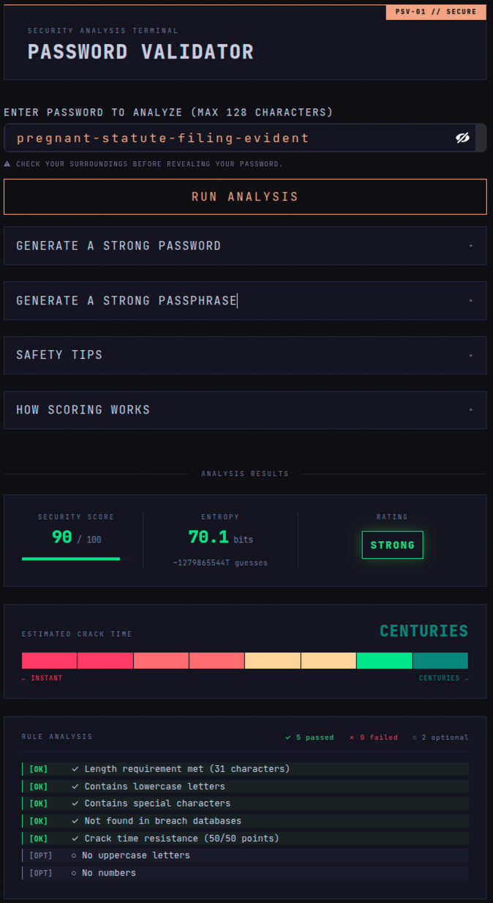
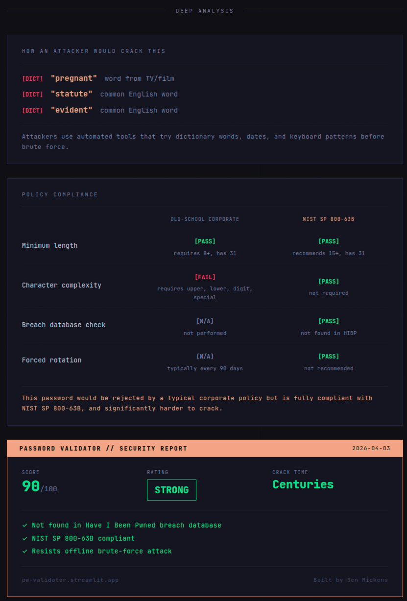
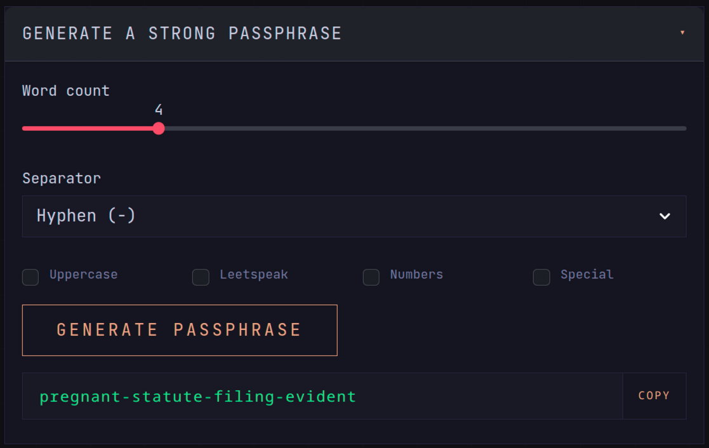

# Password Validator

A password strength validator and security education tool. Scores passwords against security policies, the [Have I Been Pwned](https://haveibeenpwned.com/Passwords) breach database, and crack-time estimation via [zxcvbn](https://github.com/dwolfhuis/zxcvbn-python). Aligned with [NIST SP 800-63B Rev. 4](https://nvlpubs.nist.gov/nistpubs/SpecialPublications/NIST.SP.800-63B-4.pdf).

Available as both a CLI tool and a Streamlit web UI at [pw-validator.streamlit.app](https://pw-validator.streamlit.app).

<p align="center">
  
</p>

## Features

- **7-rule scoring system** (100 points max): length, uppercase, lowercase, numbers, special characters, breach database check, and crack-time resistance
- **Entropy display**: bits of entropy and plain-English guess count shown alongside the score, so users understand what makes a password hard to crack
- **Attack method breakdown**: shows exactly how zxcvbn would classify the password (dictionary words, keyboard walks, date patterns, repeated sequences) and how an attacker would exploit each
- **Policy compliance panel**: side-by-side comparison of Old-School Corporate policy vs. NIST SP 800-63B, making it easy to show why a strong passphrase can fail legacy rules but pass modern ones
- **Shareable result card**: a screenshot-ready security report showing score, rating, crack time, and key compliance checks
- **Breach context**: when HIBP flags a password, explains what credential stuffing is and why the breach count matters
- **Crack-time estimation** using zxcvbn's offline slow-hashing model (bcrypt at 10K guesses/sec), aligned with the [Hive Systems 2025 methodology](https://www.hivesystems.com/blog/are-your-passwords-in-the-green)
- **Breach database checking** via the [Have I Been Pwned](https://haveibeenpwned.com/Passwords) Pwned Passwords API. Over 900 million compromised passwords are checked using k-anonymity so your password never leaves your device
- **Streamlit web UI** with color-coded score, rating badges, threat gauge, and built-in generators
- **Password generator**: cryptographically secure random passwords with configurable length and character sets
- **Passphrase generator**: random passphrases from the [EFF diceware wordlist](https://www.eff.org/dice) (7,776 words) with options for uppercase, leetspeak, digits, special characters, and configurable word count/separator
- **Safety Tips**: expandable panel with password hygiene advice aligned with NIST, including links to [1Password](https://1password.com/) and [YubiKey](https://www.yubico.com/get-yubikey)
- **How Scoring Works**: expandable panel explaining the full scoring system including entropy, bits, and guesses in plain English

<table>
  <tr>
    <td></td>
    <td></td>
  </tr>
</table>

## Setup

```bash
pip install zxcvbn requests streamlit
```

## Usage

**CLI:**
```bash
python3 password_validator.py
```

**Web UI:**
```bash
streamlit run app.py
```

## Scoring

Passwords are scored out of 100 points across 7 categories. Crack-time resistance carries the most weight (up to 50 points) because it directly measures real-world entropy. Character diversity rules are useful nudges, not a substitute for genuine unpredictability. A long passphrase with only lowercase letters can outrank a short, complex password if its crack time is substantially higher.

Per NIST SP 800-63B, character complexity rules (uppercase, numbers, special characters) are **not required** and are marked as optional in the rule analysis. The scoring still rewards them as a small bonus.

| Category | Points |
|----------|--------|
| Length (15+ characters) | 10 |
| Contains uppercase letters | 5 |
| Contains lowercase letters | 5 |
| Contains numbers | 5 |
| Contains special characters | 5 |
| Not found in breach databases | 20 |
| Crack-time resistance | 0-50 |

### Crack-Time Resistance

Points are awarded based on how long it would take to crack the password assuming bcrypt hashing at 10,000 guesses per second:

| Estimated Crack Time | Points |
|----------------------|--------|
| Less than 1 second | 0 |
| Less than 1 minute | 5 |
| Less than 1 hour | 10 |
| Less than 1 day | 20 |
| Less than 1 year | 30 |
| Less than 100 years | 40 |
| 100+ years | 50 |

### Final Rating

| Rating | Score Range |
|--------|-------------|
| EXCELLENT | 100 |
| STRONG | 80-95 |
| GOOD | 60-75 |
| FAIR | 40-55 |
| WEAK | Below 40 |

Any password that can be cracked in under 1 hour or is found in [Have I Been Pwned](https://haveibeenpwned.com/Passwords) is automatically rated **WEAK** regardless of its total score.

## Standards

Scoring, tips, and length recommendations are aligned with [NIST SP 800-63B Rev. 4](https://nvlpubs.nist.gov/nistpubs/SpecialPublications/NIST.SP.800-63B-4.pdf). Key guidance followed:

- Minimum 15 characters for single-factor authentication
- No mandatory character complexity requirements
- No forced password rotation
- Breach database checking required
